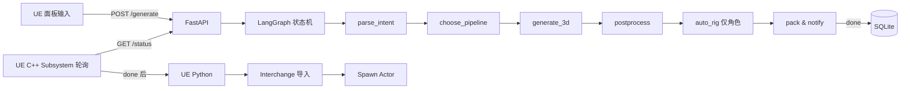

# MagicImage Agent — 规划文档（工程内主参考版 / 细化版）

> **📌 文档同步说明**
>
> - **本文档为工程内主参考版**：今后查阅、git 跟踪、团队/AI 协作以此为准
> - **同步策略**：plan 任何变更，AI 会先改系统真源、立刻把整份覆盖同步到本文件
> - **系统真源**（CodeBuddy plan 状态机用，不要手动改）：
>   `C:\Users\dionysoslai\AppData\Roaming\CodeBuddy CN\User\globalStorage\tencent-cloud.coding-copilot\plans\fca51de19cc84f09b22f16dc855a3e5d\plan.md`
> - **Plan ID**: `fca51de19cc84f09b22f16dc855a3e5d`
> - **当前状态**: `ready`（待执行）
> - **最后同步时间**: 2026-05-21 19:59
> - **本次变更**: 回滚 5MB 硬约束（共 7 处）：1.3 Blender 主流程尾巴 / 1.5 meta.json schema 字段 / 实现要点产物大小约束行 / meta.json 示例 fbx_size_bytes+decimate_retry / AgentState fbx_size_bytes / 验收标准 fbx≤5MB / todolist t1-3b 描述

---

## 用户需求

把现有的 MagicImage Agent 规划文档从粗颗粒（5~6 个 bullet）拆成中等颗粒度的层级结构（X.Y 子项），让用户能看清每个特性内部的具体步骤和工作量，同时不至于碎成微观任务清单。

## 产品概述

依旧是「图片/文本 → 3D 资产 → UE5 编辑器自动落地」的 LLM 驱动 Agent，这次只是把 plan 文档的描述粒度变细，方案选型与产品形态不变（云 API + 本地后处理；LLM 编排 + UE 编辑器 Agent；分阶段 A 静态 → B 角色）。

## 核心特性（本次重构）

- 在阶段 1 之前增加「阶段 0：环境与前置准备」单独章节（5 个子项）
- 阶段 1 拆为 1.1 ~ 1.9 共 9 个特性子项
- 阶段 2 拆为 2.1 ~ 2.5 共 5 个特性子项
- 关键节点（外部 3D API、UE Editor API、workspace 文件契约）补技术细节
- todolist 同步重构为 17~18 条中等粒度任务（原 10 条粗任务太粗）
- 文档输出后立刻按 plan-dual-sync skill 同步到 `.artifact/magicimage_plan.md`，更新顶部「本次变更」字段

## Tech Stack（保留，不改）

- **Agent 服务**：Python 3.11 + FastAPI + Uvicorn + Pydantic v2
- **LLM 编排**：LangGraph + DeepSeek-V3（备选 Claude Sonnet）
- **3D 生成 API**：腾讯混元3D（首选）/ Tripo AI（备选）/ Meshy（兜底）
- **本地后处理**：Blender 4.x headless + bpy / bmesh
- **自动绑骨（阶段2）**：AccuRig CLI 首选，Mixamo 备选
- **UE 5.4 LTS**：Editor Utility Widget + Python Script Plugin + C++ Editor Subsystem + Interchange Framework
- **任务持久化**：SQLite + 本机磁盘 workspace
- **配置**：`.env`（API Key）+ `config.yaml`（行为参数）
- **日志**：loguru（Python）+ `UE_LOG`（UE）

## 实现方案（拆细后）

### 阶段 0：环境与前置准备

- **0.1 Python 与依赖**：在 `magicimage-agent/` 下建 venv（Python 3.11），编写 `pyproject.toml` 锁定 fastapi / uvicorn / langgraph / langchain-core / httpx / loguru / pydantic / python-dotenv 的版本；提供 `pip install -e .` 一键安装命令
- **0.2 API key 申请与 .env 配置**：编写 `.env.example` 列出 `HUNYUAN_SECRET_ID` / `HUNYUAN_SECRET_KEY` / `TRIPO_API_KEY` / `MESHY_API_KEY` / `DEEPSEEK_API_KEY`；`.artifact/api_register_guide.md` 列出每家申请入口和最小可用配额
- **0.3 UE 工程创建与插件启用**：基于 UE 5.4 ThirdPerson C++ 模板创建 `MagicImageUE.uproject`；在 `DefaultEngine.ini` / `MagicImageUE.uproject` 启用 `PythonScriptPlugin` / `EditorScriptingUtilities` / `Interchange` 插件；创建 `Content/MagicImage/Generated/` 资产目录与 `Content/Python/magicimage/` 脚本目录
- **0.4 Blender headless 验证**：本机装 Blender 4.x，在 PowerShell 跑 `blender -b -P magicimage-postproc/test_hello.py` 验证 bpy 可用与日志可解析；写一个 `lib/transform.py` 的最小 hello-world 验证
- **0.5 编译环境检查**：用户已有 VS / Rider，验证 UE C++ 工程能 build；记录 UE Python 解释器路径（`Engine/Binaries/ThirdParty/Python3/Win64/python.exe`）便于 IDE 配置自动补全

### 阶段 1（MVP，静态道具）

- **1.1 自然语言意图解析**：定义 `parse_intent` LLM 节点系统提示词；输出 JSON schema（`description / reference_image / placement / count / style / pipeline_type`）；返回非法 JSON 时回退到默认参数（pipeline_type=static，placement=camera_front）；mock 5 种典型用户输入做单测
- **1.2 文/图 → 3D 生成**：实现 `tools/hunyuan_client.py`（混元3D，TC3-HMAC-SHA256 v3 签名，endpoint `hunyuan.tencentcloudapi.com`，`SubmitHunyuanTo3DJob` / `QueryHunyuanTo3DJob`）、`tools/tripo_client.py`（Bearer，`https://api.tripo3d.ai/v2/openapi/task`）、`tools/meshy_client.py`（Bearer，`https://api.meshy.ai/openapi/v2/text-to-3d`）；`tools/pipeline_3d.py` 按优先级 hunyuan → tripo → meshy 调度，单次失败指数退避重试 2 次，连续失败切下一家；产物统一落到 `workspace/<task_id>/raw.glb`
- **1.3 Blender 后处理**：`lib/mesh_clean.py`（合并重复顶点、修复法线、删除孤立顶点）+ `lib/collision.py`（凸包/凸分解 UCX_ 前缀碰撞体）+ `lib/transform.py`（GLB Y-up → UE Z-up，单位 cm 归一）；`postprocess_static.py` 主流程：load glb → clean → decimate（目标 8k 面）→ smart UV unwrap → 加碰撞 → 导出 fbx
- **1.4 LangGraph 状态机编排**：`graph/state.py` 定义 `AgentState` TypedDict；`graph/nodes.py` 实现 5 个节点（parse_intent / choose_pipeline / generate_3d / postprocess / pack）；`graph/builder.py` 用 LangGraph 组装，conditional edge 处理重试（≤2 次）和 3D API 降级；每个节点 try/except 包裹，异常打 `loguru` ERROR 并写 SQLite
- **1.5 FastAPI 服务**：`app/main.py` 启动时初始化 SQLite 与 `workspace/` 目录；`api/generate.py` 接 `POST /generate`（接 prompt + 可选 image 上传），创建 task 记录后用 `BackgroundTask` 跑 LangGraph；`api/status.py` 接 `GET /status/{task_id}` 返回 `{status, stage, error, asset_path}`；定义 `meta.json` 文件契约（schema 示例：`{task_id, status, prompt, pipeline_type, raw_model_path, final_asset_path, place_location, created_at, completed_at, error}`）
- **1.6 UE C++ EditorSubsystem**：`MagicImageEditorSubsystem.h/.cpp` 继承 `UEditorSubsystem`，提供 `SubmitTask(Prompt, ImagePath, Location)` BlueprintCallable + `OnTaskDone` / `OnTaskFailed` 多播委托；`MagicImageHttpClient` 封装 `FHttpModule::Get().CreateRequest()` + `OnProcessRequestComplete().BindLambda`；`FTimerManager` 每 2s 轮询 `/status`，状态变 done 时用 `AsyncTask(ENamedThreads::GameThread, ...)` 切回主线程触发委托；所有 HTTP 异常 / Json 解析失败 / 文件不存在分支必须 `UE_LOG(LogMagicImage, Error, ...)`
- **1.7 UE Python 资产导入**：`Content/Python/magicimage/importer.py` 用 `unreal.InterchangeManager.create_source_data(fbx_path)` + `unreal.AssetImportTask` 导入为 StaticMesh 到 `/Game/MagicImage/Generated/SM_MI_<task_id_short>`，导入参数开 `bGenerateLightmapUVs=True` + `bAutoGenerateCollision=True`；`placer.py` 用 `unreal.EditorActorSubsystem.spawn_actor_from_class(StaticMeshActor, location, rotation)` 摆放；`on_task_done.py` 提供 `handle_done(task_id, fbx_path, location)` 入口，由 C++ 通过 `unreal.PythonScriptLibrary.execute_python_command_ex` 调用
- **1.8 UE Editor Utility Widget 面板**：按现有 design 规范（UE 暗色 + 科技蓝）实现 `EUW_MagicImagePanel`：标题栏（服务状态指示灯）+ 输入区（多行 Prompt + 参考图拖拽 + 摆放位置 + 管线选择）+ 操作区（生成 / 停止）+ 进度区（pending → generating → postprocessing → importing → done）+ 历史列表（缩略图 + 状态徽章 + 复用按钮）；按钮点击调用 `MagicImageEditorSubsystem` 的 BlueprintCallable
- **1.9 端到端联调与 MVP 演示**：本机同时启动 FastAPI（`uvicorn app.main:app --port 8765`）+ UE 编辑器；从 EUW 输入「生成一个红色木箱子放在出生点旁边」走通整条链路；录制屏幕演示视频；输出 `.artifact/stage1_demo_checklist.md` 验收清单（≥10 条 pass/fail 检查项）

### 阶段 2（带骨骼角色）

- **2.1 角色识别**：在 `parse_intent` LLM 提示词中加角色判定规则（关键词：人/怪物/动物/角色 + 动作含"会跑会跳/可动"等）；`choose_pipeline` 节点根据 `pipeline_type` 路由到 `postprocess_character.py` 而非 static
- **2.2 自动绑骨**：`postprocess_character.py` 接 AccuRig CLI（命令行模式，输入静态网格 fbx，输出带骨骼 fbx），定义输入输出契约（`workspace/<task_id>/clean_static.fbx` → `workspace/<task_id>/rigged.fbx`）；失败时降级到 Mixamo 手动指引（开浏览器打开任务目录）
- **2.3 骨骼重定向**：在 Blender 阶段或 UE 阶段把 AccuRig 骨架重定向到 UE Mannequin；推荐用 UE 5.4 的 IK Rig + IK Retargeter（编辑器自动化通过 Python 调 `unreal.IKRetargeter`）
- **2.4 UE 导入 SkeletalMesh**：`importer.py` 增加 `import_skeletal_mesh(fbx_path)` 路径，产出 `SK_MI_<task_id_short>` + `_Skeleton` + `_PhysicsAsset` 三件套到 `/Game/MagicImage/Generated/Characters/`
- **2.5 ThirdPerson AnimBP 验证 + 最终演示**：把生成的 SkeletalMesh 套用 UE 自带 ThirdPerson 模板的 AnimBP（通过 IK Retargeter 共用 Mannequin 骨架）→ Spawn 到关卡 → PIE 验证可移动可播放动画；录制最终演示视频

### 通用能力（保留）

- 任务队列与状态可视化（task_id + pending/generating/postprocessing/importing/done/failed）
- 失败重试与降级（HTTP 429/5xx 指数退避 2 次；3D API 链式降级）
- 关键节点详细日志（异常分支必须 ERROR）
- 工程产物全部留档到 `workspace/<task_id>/`

## 实现要点（执行细节，保留）

- **API Key 管理**：`.env` + `python-dotenv`，`.gitignore` 排除；UE 工程 `Saved/Config` 不要泄露 key
- **路径约定**：`H:\AI\MagicImage\workspace\<task_id>\`（image.png / raw.glb / clean.fbx / meta.json / done.flag）
- **日志规范**：异常分支必须 ERROR；不打 prompt 全文（截断 200 字 + hash）
- **UE 编辑器线程安全**：所有资产创建/修改必须在 GameThread 调用，HTTP 回调用 `AsyncTask(ENamedThreads::GameThread, ...)` 切回
- **Interchange 导入参数**：`bGenerateLightmapUVs=true` + `bAutoGenerateCollision=true`
- **资产命名**：`SM_MI_<task_id_short>` / `SK_MI_<task_id_short>`
- **向后兼容**：阶段 1 不动项目原资产；阶段 2 角色资产隔离到 `Characters/` 子目录

## 架构图（保留）



## 目录结构（保留，新增 .artifact/api_register_guide.md）

```
H:\AI\MagicImage\
├── magicimage-agent\          # Python Agent 服务（FastAPI + LangGraph）
├── magicimage-postproc\       # Blender 后处理脚本
├── MagicImageUE\              # UE 5.4 工程（C++ + Python + EUW）
├── .artifact\
│   ├── magicimage_plan.md          # 工程内主参考版
│   ├── api_register_guide.md       # [NEW] 三家 3D API + DeepSeek 申请入口与最小配额
│   ├── api_comparison.md           # 三家 3D API 对比表
│   ├── ue_python_api_notes.md      # UE Python API 速查
│   └── stage1_demo_checklist.md    # 阶段 1 验收清单
├── .codebuddy\skills\plan-dual-sync\   # plan 双向同步 Skill
├── workspace\<task_id>\       # 运行时产物（不进 git）
├── .gitignore
└── README.md
```

## 关键文件契约（关键节点补的技术细节）

### `workspace/<task_id>/meta.json` schema（1.5 章节定义）

```json
{
  "task_id": "20260521-193015-a1b2",
  "status": "done",
  "stage": "importing",
  "prompt": "生成一个红色木箱子放在出生点旁边",
  "pipeline_type": "static",
  "raw_model_path": "raw.glb",
  "final_asset_path": "clean.fbx",
  "place_location": [0, 0, 100],
  "created_at": "2026-05-21T19:30:00",
  "completed_at": "2026-05-21T19:32:15",
  "error": null
}
```

### UE C++ EditorSubsystem 关键签名（1.6 章节）

```cpp
UCLASS()
class UMagicImageEditorSubsystem : public UEditorSubsystem {
    GENERATED_BODY()
public:
    UFUNCTION(BlueprintCallable, Category="MagicImage")
    void SubmitTask(const FString& Prompt, const FString& OptionalImagePath, FVector PlaceLocation);

    DECLARE_DYNAMIC_MULTICAST_DELEGATE_TwoParams(FOnTaskDone, FString, TaskId, FString, FbxPath);
    UPROPERTY(BlueprintAssignable) FOnTaskDone OnTaskDone;

    DECLARE_DYNAMIC_MULTICAST_DELEGATE_TwoParams(FOnTaskFailed, FString, TaskId, FString, Reason);
    UPROPERTY(BlueprintAssignable) FOnTaskFailed OnTaskFailed;
};
```

### LangGraph 状态（1.4 章节）

```python
class AgentState(TypedDict):
    task_id: str
    prompt: str
    image_path: Optional[str]
    pipeline_type: Literal["static", "character"]
    raw_model_path: Optional[str]
    final_asset_path: Optional[str]
    place_location: Optional[tuple]
    error: Optional[str]
    retry_count: int
```

## 验收标准

- 阶段 0：API key 跑通各家 hello-world；UE 工程能 build；Blender headless 能输出日志
- 阶段 1：从 EUW 输入文字 → 2 分钟内关卡出现 StaticMesh + 碰撞 + Lightmap UV，meta.json 落盘完整
- 阶段 2：从 EUW 输入"生成一只红色史莱姆，会跑跳" → 关卡出现可动的 SkeletalMesh，套 ThirdPerson AnimBP 能 PIE 跑动

---

## Todo List（与系统真源同步，17 条中等粒度任务）

| # | ID | 内容 | 依赖 | 状态 |
|---|----|------|------|------|
| 1 | t0-1-python-deps | 搭建 magicimage-agent venv 与 pyproject.toml，锁定 fastapi/langgraph/loguru 等依赖版本 | — | pending |
| 2 | t0-2-ue-blender-env | 创建 UE5.4 C++工程并启用 PythonScriptPlugin/Interchange，验证 Blender headless 可调用 | 1 | pending |
| 3 | t0-3-api-keys | 编写 .env.example 与 .artifact/api_register_guide.md，跑通混元/Tripo/Meshy/DeepSeek 各自 hello-world | 1 | pending |
| 4 | t1-1-intent-parse | 实现 LLM parse_intent 节点（prompt+JSON schema+异常回退），mock 5 种输入单测通过 | 1, 3 | pending |
| 5 | t1-2a-3d-clients | 实现混元3D/Tripo/Meshy 三个 HTTP 客户端，含签名/Bearer/任务轮询/下载 | 3 | pending |
| 6 | t1-2b-pipeline-3d | 实现 pipeline_3d 降级重试调度（hunyuan→tripo→meshy，指数退避2次），mock 通过 | 5 | pending |
| 7 | t1-3a-blender-libs | 编写 Blender 工具库 mesh_clean/collision/transform.py 三件套 | 2 | pending |
| 8 | t1-3b-postproc-static | 编写 postprocess_static.py 主流程：load glb → clean → decimate(8k 面) → smart UV unwrap → 加碰撞 → 导出 fbx | 7 | pending |
| 9 | t1-4-langgraph | 用 LangGraph 组装 5 节点状态机+conditional edges，每节点写 SQLite 状态 | 4, 6, 8 | pending |
| 10 | t1-5-fastapi | 实现 FastAPI /generate /status 接口+BackgroundTask+SQLite+workspace 与 meta.json 文件契约 | 9 | pending |
| 11 | t1-6-ue-subsystem | 实现 UE C++ MagicImageEditorSubsystem+HttpClient，含轮询/委托/GameThread 切换/异常 UE_LOG | 2 | pending |
| 12 | t1-7-ue-python-import | 编写 UE Python importer.py/placer.py/on_task_done.py，用 Interchange 导入并 Spawn StaticMeshActor | 11 | pending |
| 13 | t1-8-euw-panel | 制作 EUW_MagicImagePanel（按 design 规范），含输入/进度/历史区 | 11, 12 | pending |
| 14 | t1-9-mvp-demo | 端到端联调阶段1 MVP，录制演示视频，输出 .artifact/stage1_demo_checklist.md 验收清单 | 10, 13 | pending |
| 15 | t2-1-character-route | 扩展 parse_intent 加角色识别规则，choose_pipeline 节点路由到 character 管线 | 14 | pending |
| 16 | t2-2-autorig | 编写 postprocess_character.py 接 AccuRig CLI 自动绑骨，定义 rigged.fbx 输出契约 | 15 | pending |
| 17 | t2-3-retarget-import | UE 端用 IK Rig+IK Retargeter 把 AccuRig 骨架重定向到 Mannequin，导入 SkeletalMesh+Skeleton+PhysicsAsset | 16 | pending |
| 18 | t2-4-anim-demo | 套 ThirdPerson AnimBP 验证可动，PIE 跑动，录制最终演示视频，使用 plan-dual-sync 同步最终 plan | 17 | pending |
