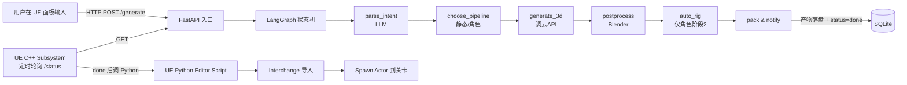

## 用户需求

开发一个「图片/文本 → 3D 资产 → UE5 编辑器自动落地」的 AI Agent，参考 Tripo/腾讯混元3D 这类游戏 UGC Agent 的能力，但聚焦在 **UE 编辑器内提效** 这个形态，分阶段从 0 搭建到可演示。

## 产品概述

一个由 LLM 驱动的 UE 编辑器智能体「MagicImage Agent」：

- 开发者在 UE 编辑器里打开一个面板，用自然语言下达指令（例："生成一个红色木箱子放在出生点旁边"）
- Agent 自动完成：意图理解 → 文生图（如需）→ 图生 3D（云 API）→ 本地后处理（清网格/减面/碰撞）→ 导入 UE 成为 StaticMesh 资产 → 在关卡中摆放好 Actor
- 阶段 2 扩展支持角色：自动绑骨 + 重定向到 UE Mannequin，产出 SkeletalMesh 可直接驱动动画

## 核心特性

### 阶段 1（MVP，静态道具）

- 自然语言意图解析：LLM 把用户一句话拆成「描述/参考图/摆放位置/数量/风格」等参数
- 文/图 → 3D：调用云 API（首选腾讯混元3D，备选 Tripo / Meshy），轮询任务直到产出 GLB/FBX
- 本地后处理：用 Blender 后台脚本做减面、UV 整理、自动凸包碰撞、统一缩放 / 朝向
- UE 自动落地：编辑器 Python 调 Interchange/FbxImporter 把后处理产物导入为 StaticMesh，并在当前关卡 Spawn Actor 摆好位置
- 编辑器面板：UE Editor Utility Widget 提供输入框 + 参考图上传 + 任务状态 + 生成历史
- 产物硬约束：单个 fbx 文件大小不超过 5MB；超出时由后处理节点自动加大 decimate 比例并重导出

### 阶段 2（带骨骼角色）

- 角色识别：LLM 判定意图为角色时走角色管线
- 自动绑骨：调 AccuRig CLI / Mixamo（备选）做骨架与蒙皮权重
- 骨骼重定向：用 Blender + UE IK Rig/IK Retargeter 映射到 UE Mannequin
- 产出 SkeletalMesh 资产 + Skeleton + PhysicsAsset，可直接套用 UE 自带 ThirdPerson AnimBP 验证

### 通用能力

- 任务队列与状态可视化：每次生成有 task_id，UE 面板可看到 pending/running/done/failed
- 失败重试与降级：API 超时/限流/质量过差时自动重试或换备用 API
- 关键节点详细日志：异常分支必须 Log（API 失败、文件缺失、导入失败等）
- 工程产物全部留档（图、模型、后处理结果、导入记录）便于复盘

## 技术栈选择

### 整体分层

```
┌─────────────────────────────────────────────────────────┐
│  UE 编辑器（前端）                                       │
│   - Editor Utility Widget（蓝图 UI 面板）                │
│   - Python Editor Script（资产导入 + 关卡摆放）          │
│   - C++ Editor Subsystem（HTTP 客户端 + 任务轮询）       │
└─────────────────────┬───────────────────────────────────┘
                      │ HTTP / JSON
┌─────────────────────▼───────────────────────────────────┐
│  Agent 服务（FastAPI，本机 127.0.0.1:8765）              │
│   - LLM 编排层（LangGraph 状态机 / Tool Calling）        │
│   - Tool 抽象：text_to_image / image_to_3d /            │
│                 mesh_postprocess / auto_rig / pack       │
│   - 任务管理：内存 + SQLite，BackgroundTask 异步执行     │
└──────┬───────────────────────┬──────────────────────────┘
       │                       │
       ▼                       ▼
┌──────────────┐       ┌──────────────────────────────┐
│ 云 3D 生成   │       │ 本地后处理（Blender headless）│
│ - 腾讯混元3D │       │ - bpy 脚本：减面/UV/碰撞     │
│ - Tripo      │       │ - AccuRig CLI（阶段2绑骨）   │
│ - Meshy 备选 │       │ - 导出 fbx + 元数据 json     │
└──────────────┘       └──────────────────────────────┘
```

### Tech Stack

- **Agent 服务**：Python 3.11 + FastAPI + Uvicorn + Pydantic v2
- **LLM 编排**：LangGraph（状态机+ToolCalling，比 LangChain Agent 更可控）；LLM 选 DeepSeek-V3（性价比+中文好+ToolCalling 稳定），备选 Claude Sonnet
- **3D 生成 API**：腾讯混元3D（首选：国内直连、有免费额度、文生3D+图生3D）；Tripo AI（备选：质量好、绑骨好）；Meshy（兜底）
- **本地后处理**：Blender 4.x（headless 模式 `blender -b -P script.py`），用 bpy + bmesh 做 decimate / smart UV / convex hull collision
- **自动绑骨（阶段2）**：AccuRig（Reallusion 免费工具，本地批处理）首选；Mixamo（无 CLI，用 web 自动化或保留为手动备选）
- **UE 版本**：UE 5.4 LTS（已装）
- **UE 接入**：
- Editor Utility Widget（UI 面板，蓝图）
- Python Script Plugin + Editor Scripting Utilities（资产导入与关卡摆放，UE 官方 Python API）
- C++ Editor Subsystem + HTTP Module（与 Agent 服务通信，避免编辑器线程阻塞）
- Interchange Framework（UE5.1+ 推荐的资产导入管线，对 fbx/glb 友好）
- **资产格式**：云 API 出 GLB → 后处理转 FBX（UE Interchange 对 fbx 支持最稳）
- **任务持久化**：SQLite（任务记录 + 资产元数据），文件存储用本机磁盘
- **配置管理**：`.env`（API Key）+ `config.yaml`（行为参数）
- **日志**：loguru（Python 端），UE 端用 `UE_LOG(LogTemp, Warning/Error, ...)`

## 实现方案

### 总体策略

**LLM 当大脑，工具当手脚**。LangGraph 编排一个 5 节点状态机：`parse_intent → choose_pipeline → generate_3d → postprocess → notify_ue`。UE 端只负责 UI、HTTP 调用、收到资产后做导入和摆放。Agent 服务和 UE 编辑器解耦，通过 HTTP + 文件系统约定路径交互（共享 `H:\AI\MagicImage\workspace\<task_id>\` 目录），避免 Python/UE 跨进程对象序列化的麻烦。

### 关键决策

1. **为什么 LangGraph 不用 LangChain Agent**：LangChain 的 ReAct Agent 不可控、容易死循环，LangGraph 是显式状态机，每个节点是纯函数，调试和日志都清晰
2. **为什么 GLB 转 FBX 而不直接用 GLB**：UE 的 Interchange 对 fbx 支持最成熟，自定义碰撞/Lightmap UV 等参数都能在导入时指定；GLB 路径有些坑（如材质丢失）
3. **为什么 Editor Utility Widget + Python，而不是纯 C++ Slate**：用户 UE Slate 不熟；EUW + Python 上手快，能在 1 周内出可见 UI；后续若要打包成插件再考虑 C++ 化
4. **为什么本地 FastAPI 而不是直接在 UE 内嵌 Python**：UE 内嵌 Python 受 GIL 和编辑器主线程限制，长任务会卡 UI；外部进程更稳定，且可独立部署到云端（未来扩展运行时 Agent 形态）
5. **为什么 SQLite 不用 Redis/Celery**：单机单用户场景过度设计；FastAPI BackgroundTask + SQLite 足够，未来真有并发再升级

### 性能与可靠性

- **生成耗时**：单次云 API 30~120s，后处理 5~20s，UE 导入 5~10s。整条链 ~2 分钟内
- **热点**：Blender 启动开销 ~3s，可用「Blender 常驻模式」（启动一个 blender 进程通过 stdin 喂脚本）做优化（阶段1先用每次启动的方式，简单可靠）
- **可靠性**：每个 Tool 节点必须捕获异常 + 写日志 + 返回结构化错误；LangGraph 的 conditional edge 处理失败重试（最多 2 次）和降级（混元失败切 Tripo）
- **避免技术债**：所有 Tool 都是 `(input_schema) -> output_schema` 的纯函数风格；新增一个 3D API 就是加一个 Tool 子类，不改主状态机

## 实现要点（执行细节）

- **API Key 管理**：用 `.env` + `python-dotenv`，`.gitignore` 必须排除；UE 工程的 `Saved/Config` 不要泄露 key
- **路径约定**：所有任务产物在 `H:\AI\MagicImage\workspace\<task_id>\`（image.png / raw.glb / clean.fbx / meta.json），UE 端直接读这个目录
- **日志规范**：异常分支必须 `Log.error`（API 失败、HTTP 4xx/5xx、文件不存在、Blender 退出码非0、UE 导入失败），不要用 `info` 装异常
- **重试与降级**：HTTP 429/5xx 指数退避重试 2 次；3D API 连续失败切备用 API；都失败时返回详细 reason 给 UE 面板
- **不要打日志泄密**：API key、user prompt 全文不要进日志（截断 200 字 + hash）
- **UE 编辑器线程安全**：所有资产创建/修改必须在 GameThread 里调用，HTTP 回调要用 `AsyncTask(ENamedThreads::GameThread, ...)` 切回主线程
- **Interchange 导入参数**：StaticMesh 必须开 `bGenerateLightmapUVs=true`、`bAutoGenerateCollision=true`（凹模型后续手动用 Blender 凸分解）
- **资产命名**：`SM_MI_<task_id_short>` / `SK_MI_<task_id_short>`，避免与项目原有资产冲突；自动放到 `Content/MagicImage/Generated/` 子目录
- **向后兼容**：阶段1 不引入任何对项目原有资产的改动；阶段2 的角色管线产物隔离到独立子目录

## 架构设计

### 系统架构图



### 数据流

1. UE 面板 → 收集 prompt + 可选参考图 → POST `/generate` → 拿到 `task_id`
2. UE Subsystem 每 2s 轮询 `GET /status/{task_id}` → 状态变 `done` 时拿到 `asset_path`
3. UE Python 脚本读取 `asset_path`（fbx 路径） → 调 Interchange 导入 → 在当前 Level Spawn StaticMeshActor
4. 失败时 UE 面板红字显示 `error.message`，引导用户调整 prompt 重试

## 目录结构

```
H:\AI\MagicImage\
├── magicimage-agent\                # [NEW] Python Agent 服务（FastAPI + LangGraph）
│   ├── app\
│   │   ├── main.py                  # [NEW] FastAPI 入口，挂 /generate /status /assets/{id} 路由；启动时初始化 SQLite 和工作目录
│   │   ├── api\
│   │   │   ├── generate.py          # [NEW] /generate 接口；接收 prompt+image，创建 task，启动 BackgroundTask 跑 LangGraph
│   │   │   └── status.py            # [NEW] /status/{task_id} 接口；查 SQLite 返回任务状态、错误信息、产物路径
│   │   ├── graph\
│   │   │   ├── state.py             # [NEW] LangGraph 状态定义（TypedDict）：prompt、image_path、pipeline_type、raw_model、final_asset、error
│   │   │   ├── nodes.py             # [NEW] 5 个节点函数：parse_intent / choose_pipeline / generate_3d / postprocess / pack；每个节点 try/except + 写 SQLite 状态
│   │   │   └── builder.py           # [NEW] 用 LangGraph 组装状态机；定义 conditional edges（重试/降级）
│   │   ├── tools\
│   │   │   ├── llm_client.py        # [NEW] DeepSeek/Claude 客户端封装；统一 ToolCalling 接口
│   │   │   ├── text_to_image.py     # [NEW] 阶段1 可选：用通义万相/SD API 把纯文本生成参考图
│   │   │   ├── tripo_client.py      # [NEW] Tripo AI HTTP 客户端：upload/create_task/poll/download
│   │   │   ├── hunyuan_client.py    # [NEW] 腾讯混元3D 客户端（首选）；统一返回 GLB 本地路径
│   │   │   ├── meshy_client.py      # [NEW] Meshy 兜底客户端
│   │   │   └── pipeline_3d.py       # [NEW] 3D 生成总调度：按优先级尝试 hunyuan→tripo→meshy，失败重试与切换
│   │   ├── postproc\
│   │   │   ├── runner.py            # [NEW] 调 blender -b -P 跑后处理脚本，传 task_id；解析退出码与日志
│   │   │   └── notify_ue.py         # [NEW] 后处理完成后写 done.flag 文件 + 更新 SQLite 状态
│   │   ├── store\
│   │   │   ├── db.py                # [NEW] SQLite 初始化与 task CRUD（task_id, status, prompt, error, asset_path, created_at）
│   │   │   └── workspace.py         # [NEW] 工作目录管理：为每个 task 创建 workspace/<task_id>/ 子目录
│   │   └── core\
│   │       ├── config.py            # [NEW] 加载 .env + config.yaml；统一配置入口
│   │       └── logger.py            # [NEW] loguru 配置；按天切分；异常打 ERROR 不带敏感字段
│   ├── tests\
│   │   ├── test_tripo_client.py     # [NEW] mock HTTP 测试 3D API 客户端
│   │   └── test_graph.py            # [NEW] mock 工具测试 LangGraph 状态流转
│   ├── .env.example                 # [NEW] API Key 占位（HUNYUAN_KEY / TRIPO_KEY / DEEPSEEK_KEY）
│   ├── config.yaml                  # [NEW] 行为参数（轮询间隔、重试次数、API 优先级）
│   ├── pyproject.toml               # [NEW] 依赖：fastapi, uvicorn, langgraph, langchain, httpx, loguru, pydantic
│   └── README.md                    # [NEW] 启动说明：venv 创建 / 依赖安装 / .env 配置 / uvicorn 启动命令
│
├── magicimage-postproc\             # [NEW] Blender 后处理脚本（独立目录方便单测）
│   ├── postprocess_static.py        # [NEW] 阶段1：load glb → decimate（目标面数 8k） → smart UV unwrap → 凸包碰撞 → 统一缩放朝向 → 导出 fbx
│   ├── postprocess_character.py     # [NEW] 阶段2：在 static 基础上补充：保留多部位拆分、检测 T-Pose、调用 AccuRig CLI 绑骨、导出带骨骼 fbx
│   ├── lib\
│   │   ├── mesh_clean.py            # [NEW] 网格清理工具：合并重复顶点、修复法线、删除孤立顶点
│   │   ├── collision.py             # [NEW] 自动凸包/凸分解碰撞生成（用 Blender 自带 Decimate + Convex Hull）
│   │   └── transform.py             # [NEW] 统一坐标系/单位/朝向（GLB Y-up → UE Z-up）
│   └── README.md                    # [NEW] 用法：blender -b -P postprocess_static.py -- --task_id xxx
│
├── MagicImageUE\                    # [NEW] UE 5.4 工程（C++ 模板）
│   ├── MagicImageUE.uproject        # [NEW] 启用插件：PythonScriptPlugin / EditorScriptingUtilities / HTTP / Json
│   ├── Source\
│   │   └── MagicImageUE\
│   │       ├── MagicImageUE.Build.cs              # [NEW] 模块依赖：HTTP, Json, JsonUtilities, EditorSubsystem(仅Editor)
│   │       └── Editor\
│   │           ├── MagicImageEditorSubsystem.h    # [NEW] UEditorSubsystem 子类，提供 SubmitTask / PollStatus / OnTaskDone 多播
│   │           ├── MagicImageEditorSubsystem.cpp  # [NEW] 实现：FHttpModule POST /generate、定时器轮询、回调切回 GameThread；异常分支全部 UE_LOG(Error)
│   │           ├── MagicImageHttpClient.h         # [NEW] HTTP 客户端封装（Get/Post + Json 序列化）
│   │           └── MagicImageHttpClient.cpp       # [NEW] 实现：含超时、重试、Json 解析失败的错误处理
│   ├── Content\
│   │   └── MagicImage\
│   │       ├── EUW_MagicImagePanel.uasset         # [NEW] Editor Utility Widget：输入框/参考图选择/生成按钮/状态文本/历史列表；调用 Subsystem 的 BlueprintCallable 函数
│   │       └── Generated\                          # [NEW] 自动导入产物的目标目录（运行时由 Python 脚本写入）
│   ├── Content\Python\
│   │   ├── magicimage\
│   │   │   ├── __init__.py                         # [NEW]
│   │   │   ├── importer.py                         # [NEW] 用 unreal.AssetTools / InterchangeManager 导入 fbx 为 StaticMesh；设置 LightmapUV / 碰撞参数；返回 unreal.StaticMesh 对象
│   │   │   ├── placer.py                           # [NEW] 在当前 Level Spawn StaticMeshActor，按 Subsystem 给的 location/rotation 摆放
│   │   │   └── on_task_done.py                     # [NEW] 入口函数 handle_done(task_id, fbx_path, place_location)，由 C++ Subsystem 调用 unreal.PythonScriptLibrary.execute_python_command_ex
│   │   └── init_unreal.py                          # [NEW] 启动时把 magicimage 包注册到 sys.path
│   └── Config\
│       └── DefaultEditor.ini                       # [MODIFY] 启用 PythonScriptPlugin 和 EditorScriptingUtilities
│
├── .artifact\                       # [NEW] AI 协作文档目录
│   ├── magicimage_plan.md           # [NEW] 本规划文档保留版
│   ├── api_comparison.md            # [NEW] 腾讯混元3D / Tripo / Meshy 三家 API 对比表（价格、配额、文档质量、绑骨支持）
│   ├── ue_python_api_notes.md       # [NEW] UE Python API 关键调用速查（AssetTools / Interchange / EditorActorSubsystem）
│   └── stage1_demo_checklist.md     # [NEW] 阶段1 验收清单
│
├── workspace\                       # [NEW] 运行时产物目录（不进 git）
│   └── <task_id>\                   # 每次任务一个子目录：image.png / raw.glb / clean.fbx / meta.json / done.flag
│
├── .gitignore                       # [NEW] 排除 .env / workspace/ / __pycache__ / Saved/ / Intermediate/ / Binaries/
└── README.md                        # [NEW] 项目总览：3 个子工程关系、启动顺序、Demo 演示步骤
```

## 关键代码结构（仅给最关键的几个接口）

```python
# magicimage-agent/app/graph/state.py
from typing import TypedDict, Literal, Optional
class AgentState(TypedDict):
    task_id: str
    prompt: str
    image_path: Optional[str]
    pipeline_type: Literal["static", "character"]
    raw_model_path: Optional[str]      # 云 API 产物
    final_asset_path: Optional[str]    # 后处理产物 fbx
    place_location: Optional[tuple]    # (x, y, z)
    error: Optional[str]
    retry_count: int
```

```python
# magicimage-agent/app/tools/pipeline_3d.py
class ThreeDProvider(Protocol):
    def generate(self, prompt: str, image_path: Optional[str], out_dir: Path) -> Path: ...

# 主调度按优先级 + 重试 + 降级，统一返回 GLB 路径或抛 PipelineError
def generate_with_fallback(prompt, image_path, out_dir, providers: list[ThreeDProvider]) -> Path: ...
```

```cpp
// MagicImageUE/Source/.../MagicImageEditorSubsystem.h（关键签名）
UCLASS()
class UMagicImageEditorSubsystem : public UEditorSubsystem {
    GENERATED_BODY()
public:
    UFUNCTION(BlueprintCallable, Category="MagicImage")
    void SubmitTask(const FString& Prompt, const FString& OptionalImagePath, FVector PlaceLocation);

    DECLARE_DYNAMIC_MULTICAST_DELEGATE_TwoParams(FOnTaskDone, FString, TaskId, FString, FbxPath);
    UPROPERTY(BlueprintAssignable) FOnTaskDone OnTaskDone;

    DECLARE_DYNAMIC_MULTICAST_DELEGATE_TwoParams(FOnTaskFailed, FString, TaskId, FString, Reason);
    UPROPERTY(BlueprintAssignable) FOnTaskFailed OnTaskFailed;
};
```

## UE Editor Utility Widget 面板设计

本 UI 是 UE 编辑器内嵌面板（不是 Web），用 Editor Utility Widget 蓝图实现。整体走 UE 编辑器原生暗色风格 + 强调色（科技蓝），保持与 UE 编辑器视觉一致，不做花哨设计。

### 布局（自上而下分块，单列）

1. **顶部标题栏（48px）**：左侧 LOGO+「MagicImage Agent」标题，右侧服务状态指示灯（绿/红圆点 + Online/Offline 文字），点击可重连
2. **输入区（约 220px）**：

- 多行 Prompt 输入框（5 行，支持自然语言中文）
- 参考图区：拖拽/点击上传一张图（128x128 缩略图预览，支持移除）
- 摆放位置选项：单选「相机前方」/「关卡原点」/「自定义坐标」（自定义时展开 X/Y/Z 输入）
- 管线选择：Auto / Static / Character（Auto 默认，让 LLM 决定）

3. **操作区（56px）**：

- 「生成」主按钮（科技蓝填充，禁用态灰色），右侧「停止当前任务」次按钮

4. **任务进度区（120px）**：

- 当前任务 ID + 状态条（pending → generating → postprocessing → importing → done）
- 进度条 + 当前阶段说明文本（"正在调用混元3D... 已等待 23s"）
- 失败时红色错误文本 + 「查看日志」链接（打开 workspace 目录）

5. **历史列表区（自适应，可滚动）**：

- 每行：缩略图 + Prompt 摘要 + 状态徽章 + 时间 + 「定位资产」「复用 prompt」两个按钮

### 交互细节

- 提交后输入区折叠成精简态，进度区高亮
- 任务完成时窗口顶部弹一个绿色 toast：「资产已导入并放置到关卡」，3s 自动消失
- 失败时输入区不清空，方便用户改 prompt 重试

### 视觉规范

- 风格：UE 原生暗色 + 极简 + 信息密度高
- 圆角 4px，间距统一 8/16
- 微动效：按钮 hover 明度+10%、状态变化 fade 200ms